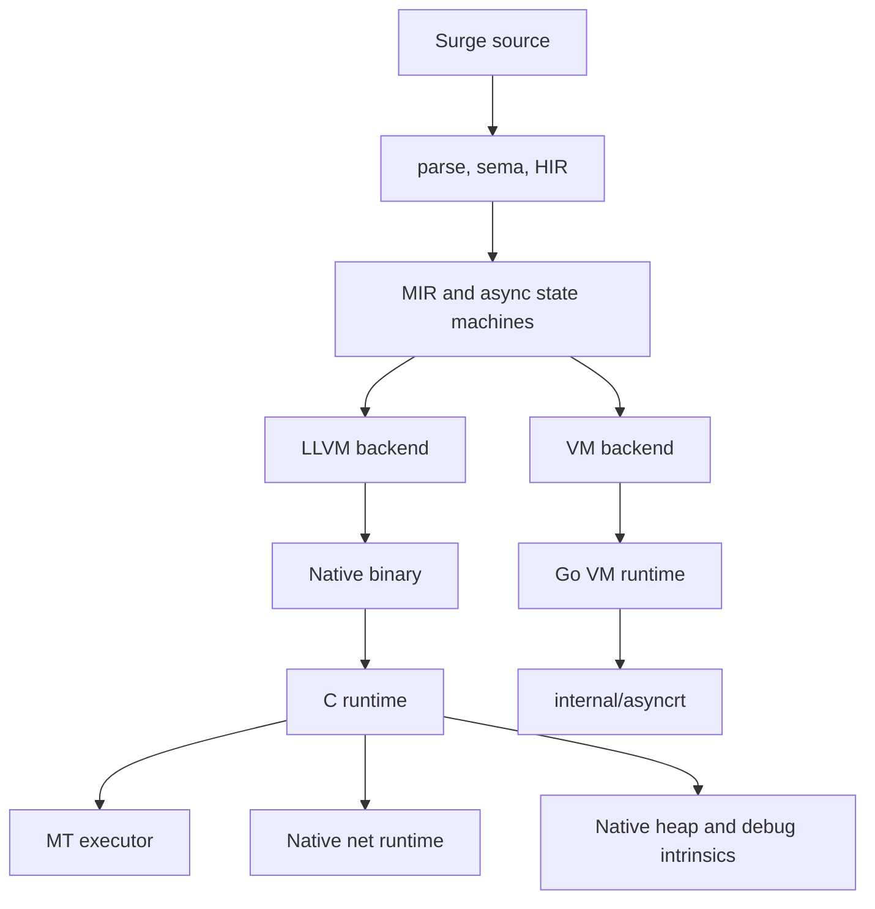
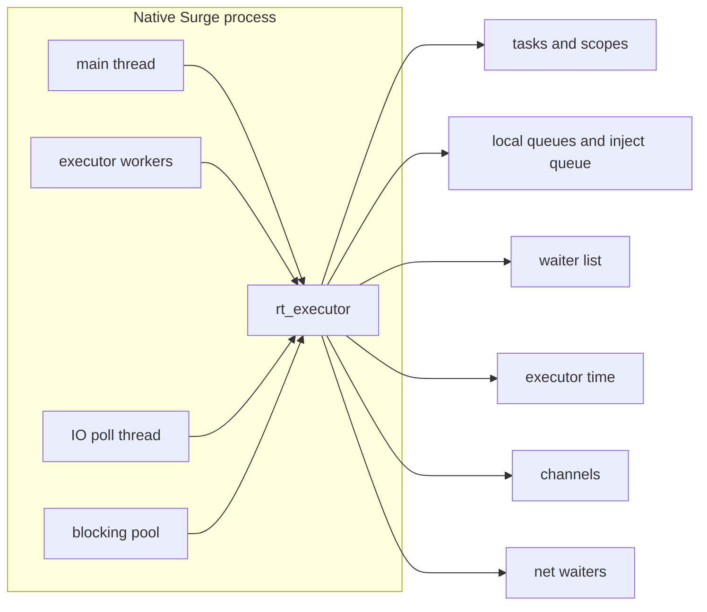
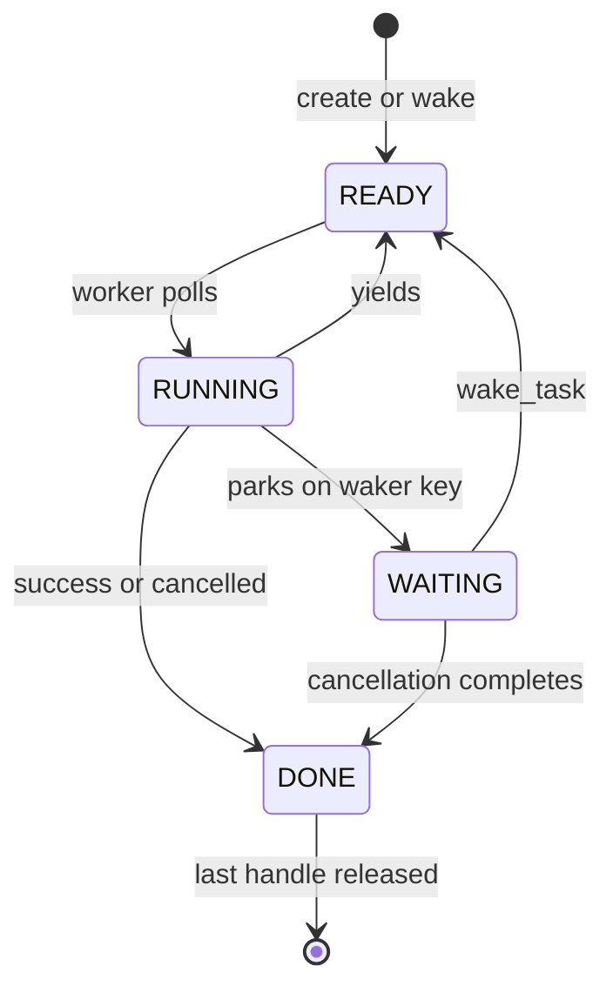
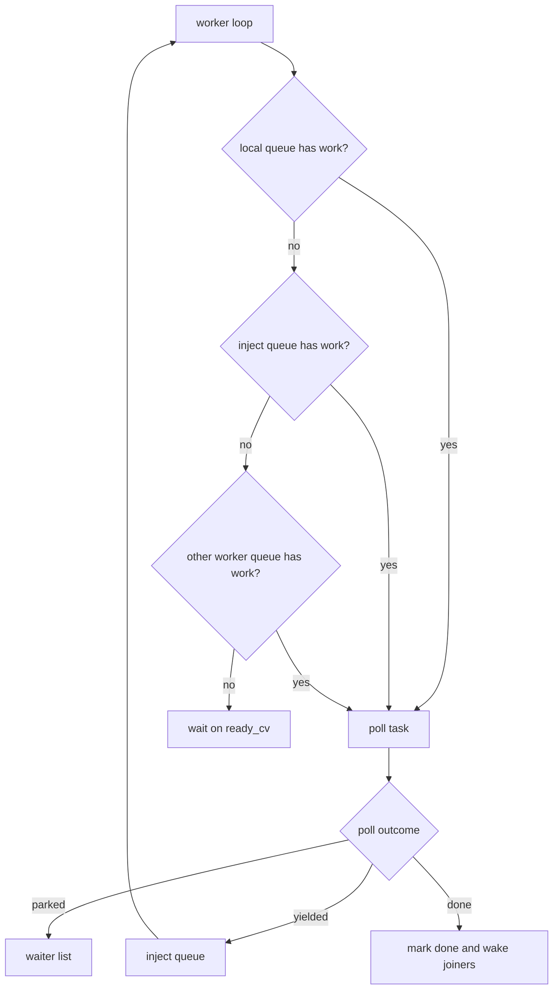
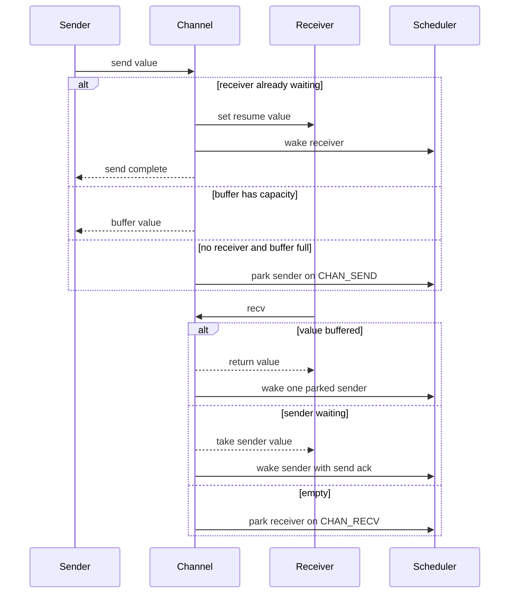

# Surge Runtime
[English](RUNTIME.md) | [Russian](RUNTIME.ru.md)

This document describes the runtime layers that execute already-lowered Surge
programs. Language-level async rules live in `docs/CONCURRENCY.md`; this file is
about the VM and native/LLVM implementation surfaces.

See also: `docs/IR.md`, `docs/CONCURRENCY.md`, `docs/TRACING.md`,
`docs/ABI_LAYOUT.md`.

For the target native runtime direction, see `docs/RUNTIME_V2.md`. That file is
a design target, not a description of the current implementation.

---

## 1. Runtime map

Surge has two execution families:

- **VM backend:** a Go MIR interpreter in `internal/vm`, used for correctness,
  golden tests, diagnostics, deterministic scheduling, and record/replay.
- **Native/LLVM backend:** LLVM emits a binary linked with the C runtime in
  `runtime/native`. This is the production async runtime with multiple executor
  workers, native sockets, a blocking pool, and native heap counters.

The VM and native backends share language semantics, but they do not share the
same scheduler implementation.

| Area | VM | Native/LLVM |
|------|----|-------------|
| Main purpose | diagnostics and parity | production execution |
| Scheduler | single-worker, deterministic by default | multi-worker executor |
| Async tasks | Go executor over MIR poll state | C executor over compiled poll functions |
| Timers | virtual by default, VM real-time mode exists | executor time |
| Blocking scope | rejected | dedicated blocking pool |
| Network I/O | direct MIR net waiters | native nonblocking sockets plus poll thread |
| Heap debug | VM object heap and RC checks | native allocation counters |

---

## 2. VM runtime

The VM executes MIR directly from `internal/vm`.

- Execution starts at the synthetic `__surge_start` produced from `@entrypoint`
  lowering.
- `VM.Step` interprets MIR instructions and terminators.
- Each call pushes a `Frame` with locals and an instruction pointer.
- Arrays, strings, structs, tagged unions, and owned values live in the VM heap.
- Layout is provided by `layout.LayoutEngine` (see `docs/ABI_LAYOUT.md`).
- Values are dropped explicitly; tests validate drop order and heap leaks.

The host interface is `Runtime` in `internal/vm/runtime.go`:

- `Argv()` provides program arguments for `@entrypoint("argv")`.
- `StdinReadAll()` powers `@entrypoint("stdin")`.
- `EntropyBytes(n)` provides host entropy for `stdlib/entropy`.
- `Exit(code)` records the exit code and stops execution.

Implementations include `DefaultRuntime`, `TestRuntime`, `RecordingRuntime`,
and `ReplayRuntime`.

### 2.1 VM async

VM async execution is handled by `internal/asyncrt`:

- tasks are stackless state machines produced by async lowering;
- the executor is single-threaded and cooperative;
- default scheduling is deterministic FIFO;
- fuzz scheduling can use a fixed seed for reproducible interleavings;
- scopes track structured concurrency and child tasks;
- channels, timers, joins, select, race, and cancellation park tasks rather than
  blocking an OS thread.

The VM is the easiest backend for semantic bugs because the scheduler is small
and deterministic. Native-only races and worker-pinning issues still need
native/LLVM tests.

---

## 3. Native/LLVM runtime

The native runtime is C code under `runtime/native`. The compiler emits calls to
runtime entry points for tasks, channels, network I/O, heap diagnostics, terminal
support, and numeric helpers.

Native async state is process-global and lazily initialized on first runtime
use. The central structure is `rt_executor` in `rt_async_internal.h`.

Important executor-owned state:

- `tasks[]`: task records, status, state pointer, result bits, cancellation, and
  handle refs.
- `scopes[]`: structured-concurrency ownership and failfast propagation.
- `waiters`: FIFO registrations keyed by join, timer, channel, net, scope, or
  blocking wait.
- `inject`: global ready queue used by non-worker threads and yielded tasks.
- `local_queues`: worker-local queues used for cache-friendly wakeups.
- `ready_cv`, `io_cv`, `done_cv`: worker, I/O, and join coordination.
- `blocking_*`: separate pool for `blocking { ... }`.

### 3.1 Task lifecycle

Core invariants:

- A task is never polled concurrently by more than one worker.
- `ex->lock` owns task transitions that touch queues, waiters, scopes, timers,
  and shutdown state.
- Ready queues store task IDs with the task `enqueued` flag set; duplicate queue
  entries are discarded.
- `wake_token` closes wake-before-park races when a wake arrives while a task is
  preparing to park.
- User poll functions run outside `ex->lock`; the transition into and out of
  `TASK_RUNNING` is protected.

### 3.2 Scheduling

Native scheduling uses worker-local queues, a global inject queue, and stealing.

Default mode is `parallel`. `SURGE_SCHED=seeded` makes scheduler choices
deterministic for the same seed and the same external event order. It does not
control OS scheduling, socket readiness order, FFI, or blocking pool timing.

Worker-local pushes are local-first but not always cross-worker wakeups. A
single item appended to the current worker's local queue is left for that worker
to consume on its next scheduler turn. Once the local queue contains more than
one ready task, the runtime signals `ready_cv` so idle workers can steal the
extra work. Global inject pushes and external wakes still signal immediately.
Before a worker enters the sync channel compatibility wait path, its local ready
work is moved to inject and broadcast to preserve progress.

Worker count:

- `SURGE_THREADS=<n>` overrides executor worker count.
- Without an override, the runtime uses the detected CPU count, with a minimum
  of 2.
- `rt_worker_count()` exposes the native worker count to Surge code.

### 3.3 Channels

Native channels are FIFO handles with optional bounded buffering. Direct channel
operations in async code use task parking:

Direct async channel handoff is the fast path. It should park tasks, not worker
threads, and should not need compensation workers.

Synchronous helper functions are different. If an async task calls a sync helper
that performs `Channel.send`, `Channel.recv`, or `Channel.close`, the native
runtime cannot suspend the helper's C stack as an async state machine. It uses a
blocking compatibility path:

- the worker temporarily parks inside the sync helper;
- `channel_blocked_workers` tracks pinned workers;
- ready work is moved out of the current local queue so other workers can see it;
- compensation workers may be started to preserve progress.

This path exists for compatibility, not speed. Hot request/reply paths should
keep channel operations directly in async code or use async helper functions.

### 3.4 Network I/O

Network readiness waits park the current async task directly:

- `rt_net_wait_accept`, `rt_net_wait_readable`, and `rt_net_wait_writable` are
  suspendable intrinsics lowered into ready/pending poll branches.
- The runtime first tries `poll(..., timeout=0)` on the fd.
- If the fd is not ready, the current task parks on a net waker key.
- The I/O thread watches registered net waiters with `poll`.
- When an fd is ready, it wakes the matching parked tasks.

These waits do not allocate `Task<nothing>` handles and do not add a join layer
between socket readiness and the user task.

The I/O thread is signaled when the executor becomes idle, when net waiters are
registered, or when shutdown changes. `TRACE_NET` counters are emitted as part
of execution tracing.

### 3.5 Blocking pool

`blocking { ... }` runs outside executor workers:

- the block becomes a `TASK_KIND_BLOCKING` task;
- work is submitted to a dedicated blocking pool;
- the async task awaits completion through a blocking waker key;
- cancellation is best-effort because the underlying OS call may not be
  preemptable.

Pool size defaults to the executor worker count and can be overridden with
`SURGE_BLOCKING_THREADS=<n>`.

### 3.6 Heap and debug intrinsics

Native allocations go through `rt_alloc`, `rt_free`, and `rt_realloc`. The
runtime tracks allocation count, free count, live blocks, and live bytes. The
`rt_heap_stats()` intrinsic exposes these counters.

The VM has its own heap model and exposes equivalent debug-facing behavior where
possible, but the native counters describe native allocation traffic only.

---

## 4. Runtime tracing

Runtime tracing is separate from compiler tracing in `docs/TRACING.md`.

| Control | Effect |
|---------|--------|
| `SURGE_TRACE_EXEC=1` | emits `TRACE_EXEC`, `TRACE_EXEC_SNAPSHOT`, and `TRACE_NET` lines to stderr |
| `SIGUSR1` with `SURGE_TRACE_EXEC=1` | requests a live execution snapshot on supported platforms |
| `SURGE_SCHED_TRACE=1` | emits `SCHED_TRACE` summary lines |
| `SURGE_SCHED=seeded` | enables seeded scheduler decisions |
| `SURGE_SCHED_SEED=<n>` | sets the seeded scheduler seed |
| `SURGE_ASYNC_DEBUG=1` | enables verbose native async debug prints |
| `SURGE_CHANNEL_WAKE_INJECT=1` | forces channel wake placement through inject for experiments |

Useful `TRACE_EXEC` fields:

- `wake_called`, `wake_enqueued`, `park_attempt`, `park_committed`: wake/park
  activity.
- `channel_blocking_wait`, `channel_task_blocking_send`,
  `channel_task_blocking_recv`: sync channel fallback from task context.
- `channel_handoff_yield`: direct async channel handoff yields.
- `compensation_started`, `compensation_high_water`: worker-pinning fallback.
- `waiters_*`, `tasks_*`, `local_total`, `inject_len`: scheduler shape at a
  snapshot.

Useful `SCHED_TRACE` fields:

- `local`, `inject`, `steal`: how many tasks were popped from worker-local
  queues, the global inject queue, or another worker's local queue.
- `events`: total scheduler pops covered by the summary line.

Useful `TRACE_NET` fields:

- `io_poll_calls`, `io_poll_timeouts`, `io_poll_timeout_max_ms`;
- `io_poll_wake_fd`, `io_poll_net_ready`, `io_poll_errors`;
- `io_poll_waiters_last`, `io_poll_waiters_max`, `io_poll_waiters_total`;
- `io_direct_waits`: direct task parks for network readiness;
- `io_waiter_scan_entries`, `io_waiter_net_entries`: generic waiter-list scan
  cost for net polling;
- `io_poll_rebuilds`, `io_poll_allocs`, `io_poll_dedup_checks`: current poll
  set rebuild cost;
- `io_waiter_complete_calls`, `io_waiter_completed`: net readiness wake/remove
  activity.

For a healthy direct async channel request/reply path, expect
`channel_task_blocking_send=0`, `channel_task_blocking_recv=0`, and
`compensation_high_water=0`. Nonzero values are not automatically wrong, but
they mean the workload used the sync compatibility path or pinned workers.

---

## 5. Troubleshooting runtime issues

Start with the smallest layer that reproduces the symptom.

1. **Backend check:** run the same program on VM and native/LLVM when possible.
   VM-only failure usually points at MIR/semantics; native-only failure usually
   points at the C runtime, LLVM lowering, or real I/O.
2. **Worker count:** force `SURGE_THREADS=1`, then a small multi-worker count
   like `SURGE_THREADS=2` or `4`.
3. **Trace counters:** run with `SURGE_TRACE_EXEC=1` and inspect channel,
   compensation, waiter, and net counters.
4. **Scheduler mode:** use `SURGE_SCHED=seeded SURGE_SCHED_SEED=<n>` for
   reproducible scheduler choices. Do not expect it to make external I/O fully
   reproducible.
5. **Channel path:** if `channel_task_blocking_*` or `compensation_*` are
   nonzero on a hot async path, look for sync helper functions hiding channel
   operations.
6. **Network path:** if net latency remains after channel counters look clean,
   compare a tiny native echo/accept program before blaming application logic.

---

## 6. Current limitations

- VM remains single-worker by design.
- Native/LLVM parallel scheduling is not globally deterministic.
- Seeded scheduling is best-effort and depends on external event order.
- The native waiter list is still a shared FIFO registration list; replacing it
  with keyed queues should be driven by measurement.
- Sync channel compatibility can still pin workers. It is a fallback, not the
  recommended shape for hot async code.
- `parallel map/reduce` and `signal` remain reserved language features.
