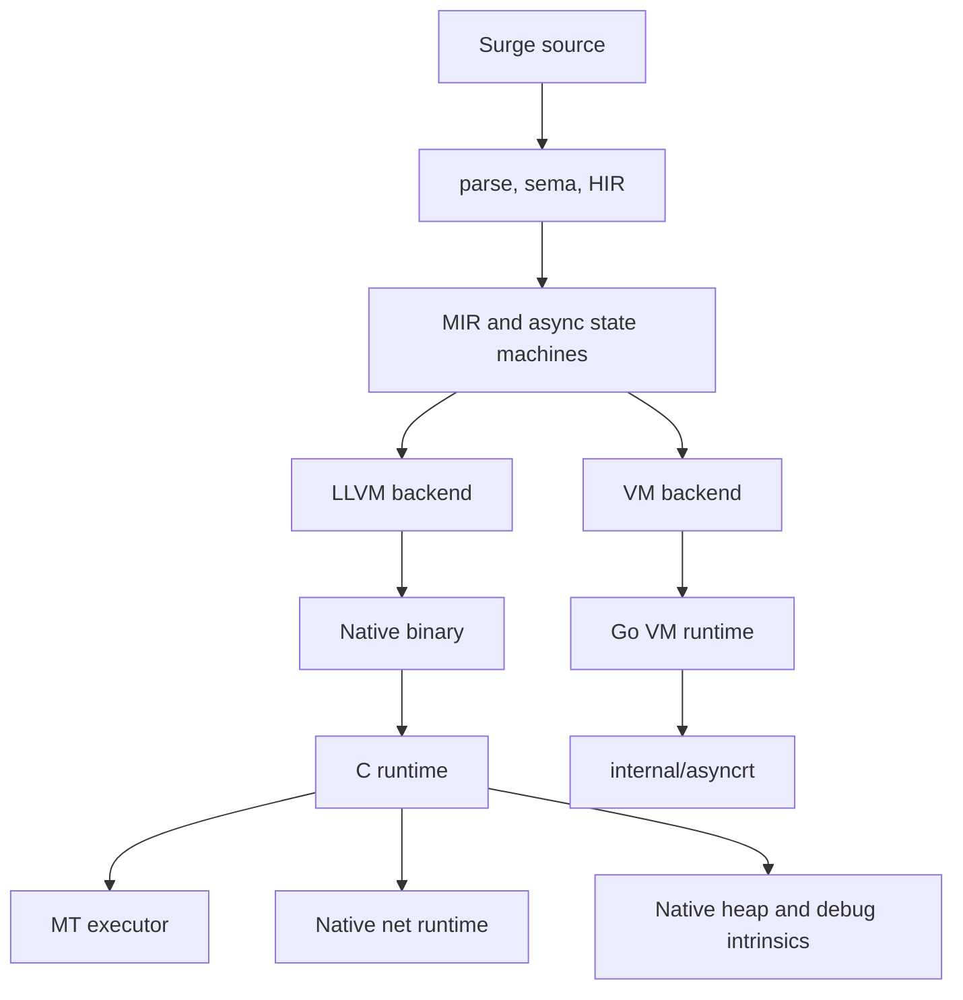
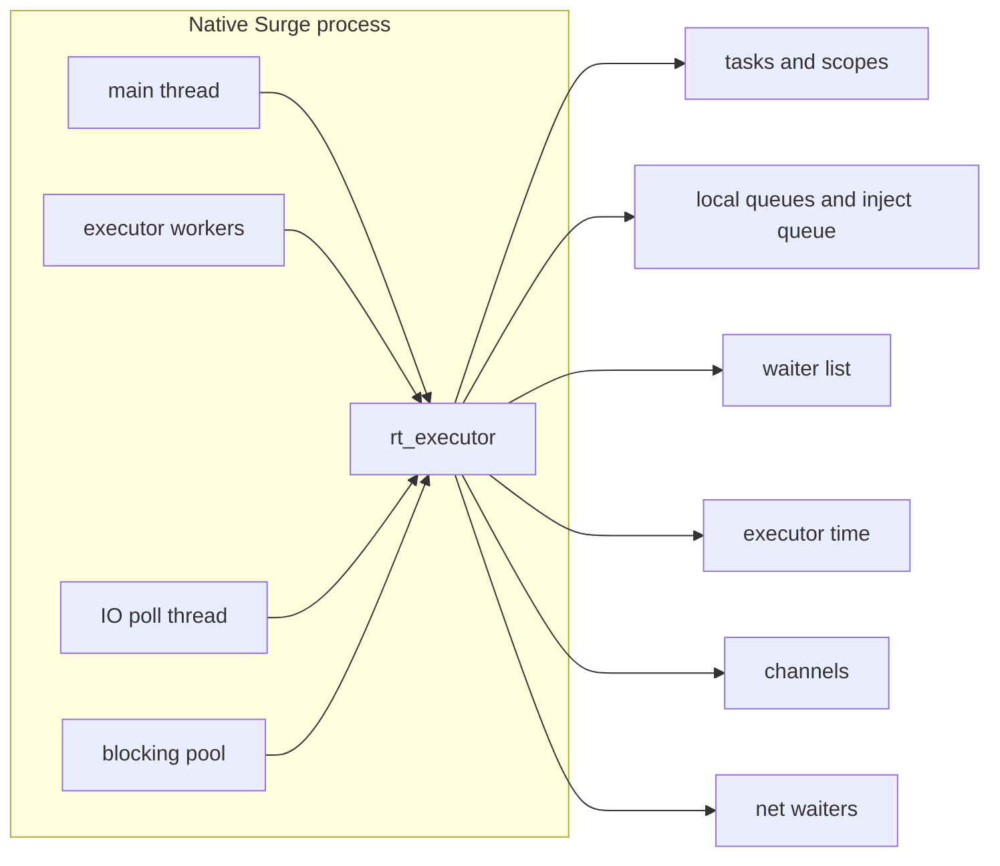
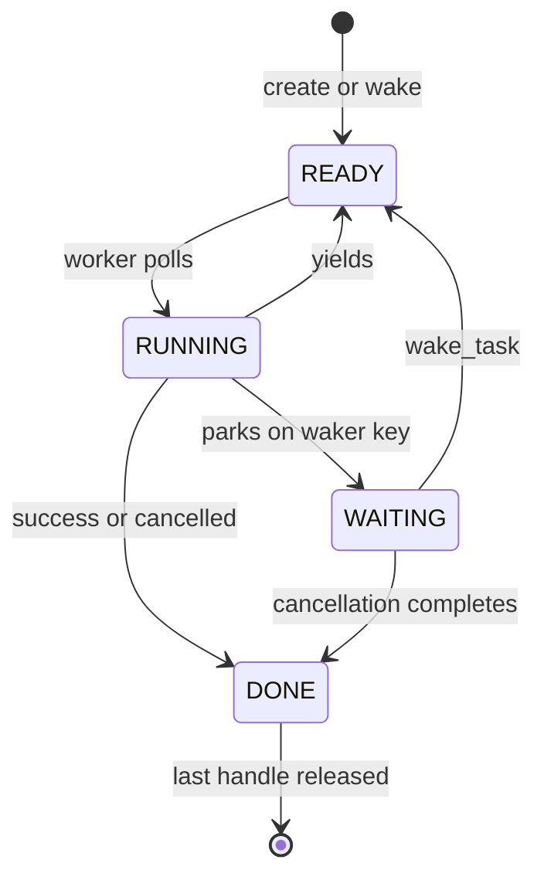
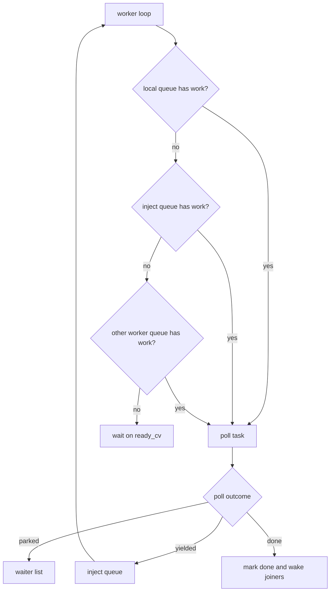
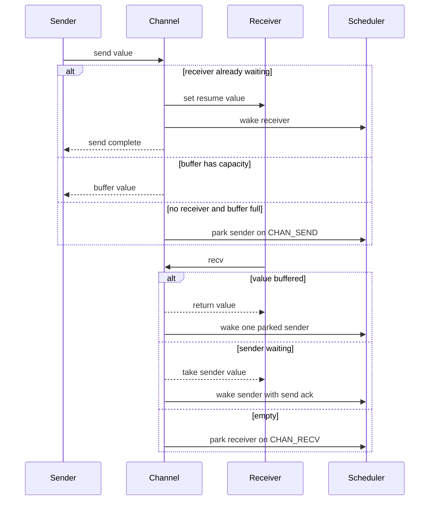

# Рантайм Surge
[English](RUNTIME.md) | [Russian](RUNTIME.ru.md)

Этот документ описывает слои рантайма, которые исполняют уже пониженные
программы Surge. Правила async на уровне языка описаны в
`docs/CONCURRENCY.ru.md`; здесь речь о реализации VM и native/LLVM.

См. также: `docs/IR.ru.md`, `docs/CONCURRENCY.ru.md`, `docs/TRACING.ru.md`,
`docs/ABI_LAYOUT.ru.md`.

---

## 1. Карта рантайма

В Surge есть две семьи исполнения:

- **VM-бэкенд:** Go-интерпретатор MIR в `internal/vm`, нужен для корректности,
  golden-тестов, диагностики, детерминированного планирования и record/replay.
- **Native/LLVM-бэкенд:** LLVM создает бинарь, связанный с C-рантаймом из
  `runtime/native`. Это production async-рантайм с несколькими worker'ами,
  native sockets, blocking pool и счетчиками native heap.

VM и native-бэкенды имеют общую семантику языка, но не общий планировщик.

| Область | VM | Native/LLVM |
|---------|----|-------------|
| Основная роль | диагностика и parity | production-исполнение |
| Планировщик | один worker, детерминирован по умолчанию | multi-worker executor |
| Async tasks | Go executor поверх MIR poll state | C executor поверх скомпилированных poll-функций |
| Таймеры | virtual по умолчанию, есть VM real-time mode | executor time |
| Blocking scope | отклоняется | выделенный blocking pool |
| Network I/O | прямые MIR net waiters | native nonblocking sockets плюс poll thread |
| Heap debug | VM object heap и RC-проверки | native allocation counters |

---

## 2. VM-рантайм

VM исполняет MIR напрямую из `internal/vm`.

- Исполнение начинается с синтетической `__surge_start`, созданной lowering-ом
  `@entrypoint`.
- `VM.Step` интерпретирует MIR-инструкции и терминаторы.
- Каждый вызов пушит `Frame` с локалами и instruction pointer.
- Массивы, строки, структуры, tagged unions и владеемые значения живут в VM heap.
- Layout задается `layout.LayoutEngine` (см. `docs/ABI_LAYOUT.ru.md`).
- Значения явно дропаются; тесты проверяют порядок drop-а и утечки heap.

Интерфейс к хосту - `Runtime` в `internal/vm/runtime.go`:

- `Argv()` дает аргументы программы для `@entrypoint("argv")`.
- `StdinReadAll()` обслуживает `@entrypoint("stdin")`.
- `EntropyBytes(n)` дает host entropy для `stdlib/entropy`.
- `Exit(code)` фиксирует код выхода и останавливает исполнение.

Реализации включают `DefaultRuntime`, `TestRuntime`, `RecordingRuntime` и
`ReplayRuntime`.

### 2.1 VM async

VM async исполняется через `internal/asyncrt`:

- задачи - stackless state machines, созданные async lowering-ом;
- executor однопоточный и кооперативный;
- планирование по умолчанию детерминированное FIFO;
- fuzz-планирование может использовать фиксированный seed для воспроизводимых
  interleavings;
- scopes отслеживают structured concurrency и дочерние задачи;
- channels, timers, joins, select, race и cancellation паркуют задачи, а не
  блокируют OS thread.

VM - самый удобный бэкенд для семантических багов, потому что планировщик малый
и детерминированный. Native-only races и worker-pinning всё равно требуют
native/LLVM тестов.

---

## 3. Native/LLVM-рантайм

Native runtime - это C-код в `runtime/native`. Компилятор генерирует вызовы
runtime entry points для задач, каналов, network I/O, heap diagnostics, terminal
support и числовых helpers.

Native async state глобален на процесс и лениво инициализируется при первом
использовании рантайма. Центральная структура - `rt_executor` в
`rt_async_internal.h`.

Важное состояние, которым владеет executor:

- `tasks[]`: записи задач, status, state pointer, result bits, cancellation и
  handle refs.
- `scopes[]`: владение structured concurrency и failfast propagation.
- `waiters`: FIFO-регистрации по ключам join, timer, channel, net, scope или
  blocking wait.
- `inject`: глобальная ready queue для non-worker threads и yielded tasks.
- `local_queues`: worker-local queues для cache-friendly wakeups.
- `ready_cv`, `io_cv`, `done_cv`: координация workers, I/O и join.
- `blocking_*`: отдельный pool для `blocking { ... }`.

### 3.1 Жизненный цикл задачи

Базовые инварианты:

- Задача никогда не poll'ится одновременно несколькими worker'ами.
- `ex->lock` владеет переходами задач, которые трогают queues, waiters, scopes,
  timers и shutdown state.
- Ready queues хранят task IDs с установленным флагом `enqueued`; дубли в
  очередях отбрасываются.
- `wake_token` закрывает wake-before-park race, когда wake приходит во время
  подготовки задачи к park.
- User poll functions выполняются вне `ex->lock`; переход в `TASK_RUNNING` и
  выход из него защищены.

### 3.2 Планирование

Native scheduling использует worker-local queues, глобальную inject queue и
stealing.

Режим по умолчанию - `parallel`. `SURGE_SCHED=seeded` делает решения
планировщика детерминированными при том же seed и том же порядке внешних
событий. Он не контролирует OS scheduling, порядок socket readiness, FFI или
timing blocking pool.

Количество worker'ов:

- `SURGE_THREADS=<n>` переопределяет число executor workers.
- Без override рантайм использует число CPU, но минимум 2.
- `rt_worker_count()` возвращает native worker count в Surge-код.

### 3.3 Каналы

Native channels - FIFO handles с опциональным ограниченным buffer. Прямые
операции каналов в async-коде используют task parking:

Direct async channel handoff - быстрый путь. Он должен парковать задачи, а не
worker threads, и не должен требовать compensation workers.

Синхронные helper-функции работают иначе. Если async-задача вызывает sync helper,
который делает `Channel.send`, `Channel.recv` или `Channel.close`, native runtime
не может приостановить C-stack этого helper'а как async state machine. Поэтому
используется blocking compatibility path:

- worker временно паркуется внутри sync helper;
- `channel_blocked_workers` считает pinned workers;
- ready work выносится из текущей local queue, чтобы другие workers могли его
  увидеть;
- compensation workers могут стартовать для сохранения progress.

Этот путь нужен для совместимости, не для скорости. Горячие request/reply paths
должны держать channel ops прямо в async-коде или использовать async helper
functions.

### 3.4 Network I/O

Network readiness waits паркуют текущую async-задачу напрямую:

- `rt_net_wait_accept`, `rt_net_wait_readable` и `rt_net_wait_writable` — это
  suspendable intrinsics, которые lowering превращает в ready/pending poll
  branches.
- Runtime сначала пробует `poll(..., timeout=0)` для fd.
- Если fd не готов, текущая задача паркуется на net waker key.
- I/O thread следит за зарегистрированными net waiters через `poll`.
- Когда fd готов, он будит matching parked tasks.

Эти ожидания не аллоцируют `Task<nothing>` handles и не добавляют join layer
между socket readiness и пользовательской задачей.

I/O thread сигналится, когда executor становится idle, когда регистрируются net
waiters или когда меняется shutdown state. `TRACE_NET` counters выводятся как
часть execution tracing.

### 3.5 Blocking pool

`blocking { ... }` выполняется вне executor workers:

- block становится `TASK_KIND_BLOCKING` task;
- работа отправляется в выделенный blocking pool;
- async task ожидает завершения через blocking waker key;
- cancellation best-effort, потому что underlying OS call может быть
  непрерываемым.

Размер pool по умолчанию равен числу executor workers и переопределяется через
`SURGE_BLOCKING_THREADS=<n>`.

### 3.6 Heap и debug intrinsics

Native allocations проходят через `rt_alloc`, `rt_free` и `rt_realloc`. Runtime
считает allocation count, free count, live blocks и live bytes. Intrinsic
`rt_heap_stats()` отдает эти counters.

У VM собственная heap model и похожее debug-facing поведение, где это возможно,
но native counters описывают только native allocation traffic.

---

## 4. Runtime tracing

Runtime tracing отделен от compiler tracing в `docs/TRACING.ru.md`.

| Управление | Эффект |
|------------|--------|
| `SURGE_TRACE_EXEC=1` | выводит `TRACE_EXEC`, `TRACE_EXEC_SNAPSHOT` и `TRACE_NET` в stderr |
| `SIGUSR1` вместе с `SURGE_TRACE_EXEC=1` | запрашивает live execution snapshot на поддерживаемых платформах |
| `SURGE_SCHED_TRACE=1` | выводит summary lines `SCHED_TRACE` |
| `SURGE_SCHED=seeded` | включает seeded scheduler decisions |
| `SURGE_SCHED_SEED=<n>` | задает seed для seeded scheduler |
| `SURGE_ASYNC_DEBUG=1` | включает подробные native async debug prints |
| `SURGE_CHANNEL_WAKE_INJECT=1` | принудительно отправляет channel wake через inject для экспериментов |

Полезные поля `TRACE_EXEC`:

- `wake_called`, `wake_enqueued`, `park_attempt`, `park_committed`: активность
  wake/park.
- `channel_blocking_wait`, `channel_task_blocking_send`,
  `channel_task_blocking_recv`: sync channel fallback из task context.
- `channel_handoff_yield`: direct async channel handoff yields.
- `compensation_started`, `compensation_high_water`: fallback для pinned workers.
- `waiters_*`, `tasks_*`, `local_total`, `inject_len`: форма scheduler snapshot.

Полезные поля `TRACE_NET`:

- `io_poll_calls`, `io_poll_timeouts`, `io_poll_timeout_max_ms`;
- `io_poll_wake_fd`, `io_poll_net_ready`, `io_poll_errors`;
- `io_poll_waiters_last`, `io_poll_waiters_max`, `io_poll_waiters_total`;
- `io_direct_waits`: прямые парковки задач на network readiness.

Для здорового прямого async channel request/reply path ожидаются
`channel_task_blocking_send=0`, `channel_task_blocking_recv=0` и
`compensation_high_water=0`. Ненулевые значения не всегда ошибка, но они
означают, что workload использовал sync compatibility path или pinned workers.

---

## 5. Диагностика runtime issues

Начинайте с самого маленького слоя, который воспроизводит симптом.

1. **Backend check:** запустите программу на VM и native/LLVM, если возможно.
   VM-only failure обычно указывает на MIR/semantics; native-only failure - на
   C runtime, LLVM lowering или real I/O.
2. **Worker count:** сначала `SURGE_THREADS=1`, затем маленькое multi-worker
   значение вроде `SURGE_THREADS=2` или `4`.
3. **Trace counters:** запустите с `SURGE_TRACE_EXEC=1` и проверьте channel,
   compensation, waiter и net counters.
4. **Scheduler mode:** используйте
   `SURGE_SCHED=seeded SURGE_SCHED_SEED=<n>` для воспроизводимых scheduler
   choices. Не ждите полной воспроизводимости внешнего I/O.
5. **Channel path:** если `channel_task_blocking_*` или `compensation_*` ненулевые
   на горячем async path, ищите sync helper functions, скрывающие channel ops.
6. **Network path:** если net latency остается после чистых channel counters,
   сравните с маленькой native echo/accept программой до обвинения application
   logic.

---

## 6. Текущие ограничения

- VM остается single-worker по дизайну.
- Native/LLVM parallel scheduling не является глобально детерминированным.
- Seeded scheduling best-effort и зависит от порядка внешних событий.
- Native waiter list пока общая FIFO registration list; замену на keyed queues
  нужно делать только по измерениям.
- Sync channel compatibility всё еще может pin workers. Это fallback, а не
  рекомендуемая форма горячего async-кода.
- `parallel map/reduce` и `signal` остаются зарезервированными возможностями
  языка.
