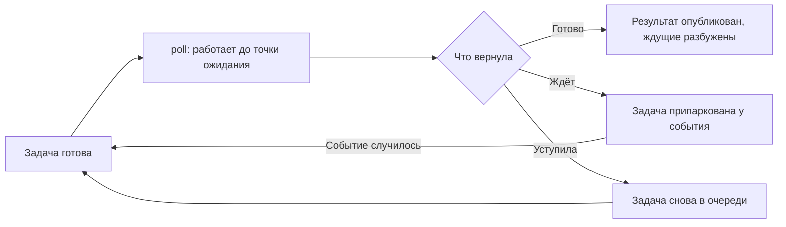
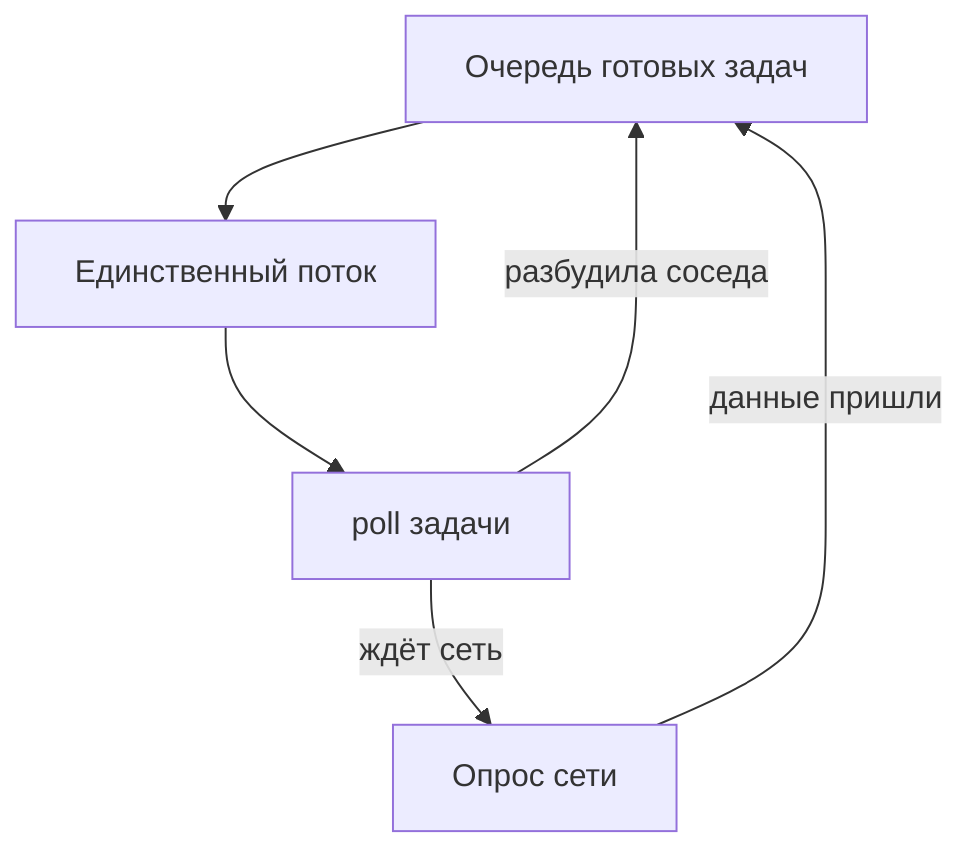
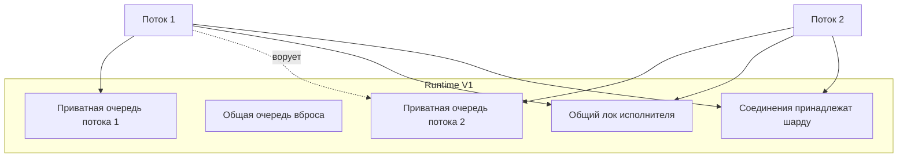
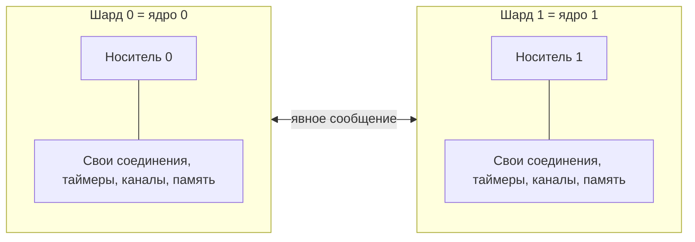
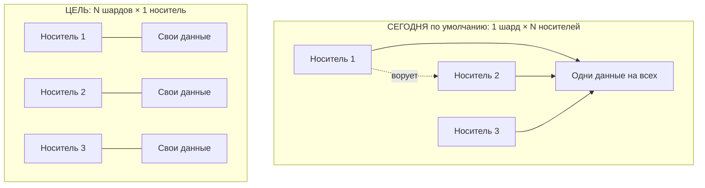
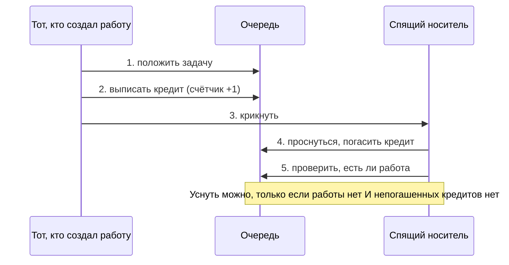
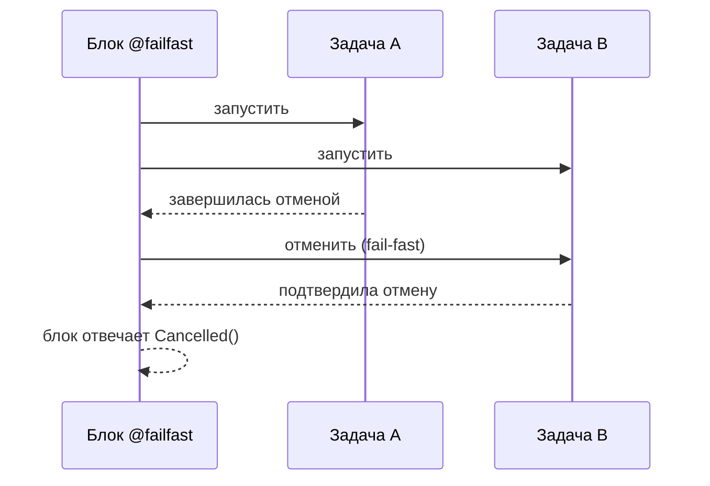
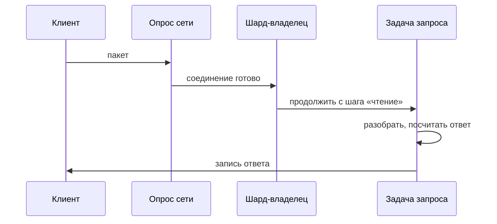

# Как устроен рантайм Surge: V1, V2 и что между ними

Статус: объясняющий документ, не нормативный. Нормативные — `docs/RUNTIME.md`
(то, что работает сегодня), `docs/RUNTIME_V2.md` (то, к чему идём) и решения
владельца, записанные в память проекта. Здесь — человеческое объяснение, для
того, кто хочет понять систему, а не только её починить.

**Как читать примеры.** У каждого листинга есть метка:

| Метка | Значение |
| --- | --- |
| ✅ **работает** | компилируется и исполняется сегодня |
| ⚠️ **принимается, но не исполняется** | компилятор принимает, бэкенд ещё не умеет (Phase 4 crossing) |
| 🅿️ **предлагается** | синтаксиса пока нет, это предложение |
| ❌ **отвергается** | компилятор отказывает, и текст объясняет почему |

**Про цифры.** Все замеры производительности датированы. Часть из них снята до
починок, которые уже в дереве, — это отмечено прямо у таблиц.

---

## 0. Словарь за две минуты

| Русский | Английский (как в коде) | Что это | Аналогия |
| --- | --- | --- | --- |
| Задача | task | работа, которая умеет останавливаться на середине | заказ на кухне |
| Носитель | carrier | поток ОС, исполняющий задачи | повар |
| Служба | service agent | поток, который обслуживает сеть и таймеры, но не готовит | официант, приносящий продукты |
| Шард | shard | набор данных с одним владельцем | рабочая станция со своими продуктами |
| Канал | channel | труба для передачи значений между задачами | окошко выдачи |
| Область (scope) | scope | блок, отвечающий за свои подзадачи | бригадир |
| Кредит | wake credit | расписка «работа есть»: пока не погашена, засыпать нельзя | не звонок, а запрет уходить домой |
| Слот «следующая» | run-next slot | место ровно для одной своей задачи | тарелка, отложенная себе |
| Класс пригодности | eligibility class | кто вправе выполнить задачу | «это блюдо готовит только гриль» |

Одно различие, вокруг которого крутится весь документ:

> **Кто владеет данными** и **кто их исполняет** — разные вопросы.
> В V1 они смешаны. В V2 разделены.

---

## 1. Фундамент: владение и заём

Без этого не понять ни одну строчку дальше, поэтому начнём отсюда.

В Surge у каждого значения есть **владелец**. Владение можно **передать**
(тогда старое имя становится недействительным) или **одолжить** (тогда значение
остаётся у владельца, а получатель видит его на время).

```surge
// ✅ работает
fn demo() -> int {
    let s: string = "текст";
    let n = length(&s);      // одолжили: s остаётся у нас
    consume(own s);          // передали: s больше нельзя использовать
    return n;
}
```

| Форма | Что значит | Кто освободит память |
| --- | --- | --- |
| `s` | значение принадлежит этому имени | это имя, на выходе из области |
| `&s` | одолжили на чтение | владелец, не заёмщик |
| `&mut s` | одолжили на изменение | владелец |
| `own s` | передали владение | новый владелец |

Из этих четырёх строк вырастает вся модель рантайма:

- **Через границу шарда едет только владение** (`own`), и только то, что не
  привязано к своей станции. Заём не едет никогда — он указывает на чужую
  память.
- **Задача, держащая заём**, не может пережить того, у кого одолжила.
- **Освобождение памяти** — это работа владельца, а не того, кто последним
  подержал значение.

---

## 2. Runtime V1 — то, что работает сегодня

### 2.1 Асинхронность без потоков

Surge компилирует асинхронный код в **машину состояний**: нет отдельного стека
на задачу, нет «зелёных потоков». Компилятор режет функцию по точкам ожидания.

Точка ожидания в Surge **всегда написана словом**: `.await()`, операция канала,
`sleep`, `checkpoint`. Ничего не ждёт молча.

```surge
// ✅ работает (стиль настоящего сетевого кода из stdlib/net)
async fn handle(conn: &TcpConn) -> int {
    let request = conn.read_some(1024:uint).await();   // точка ожидания
    let answer = lookup(request);                       // обычный код
    conn.write_all(answer).await();                     // точка ожидания
    return 0;
}
```

Компилятор превращает это в структуру с полем «на каком я шаге»:

```
шаг 0: начать чтение; данных нет — запомнить состояние и ВЫЙТИ
шаг 1: данные пришли; посчитать ответ; начать запись; не влезло — ВЫЙТИ
шаг 2: запись закончена; вернуть 0
```



Поэтому ожидание не занимает поток: задача просто выходит из `poll`, а поток
берёт следующую.

### 2.2 Однопоточный режим

Одна очередь, один поток, никакой синхронизации на горячем пути.



Число потоков и шардов задаётся снаружи:

| Переменная | Что делает | По умолчанию |
| --- | --- | --- |
| `SURGE_THREADS` | сколько носителей | число ядер, но не меньше двух |
| `SURGE_SHARDS` | сколько шардов | 1 |

Важное ограничение сегодняшнего рантайма: **если шардов больше одного, число
потоков обязано равняться числу шардов**. То есть доступны ровно две топологии:
`1 шард × N носителей` (по умолчанию) и `N шардов × 1 носитель`.

### 2.3 Многопоточный режим: где было больно

Замер **2026-06-25**, крошечный TCP-сервер, 32 клиента, **до** починки
ограниченного дренажа:

| Режим | Операция | rps | p95 | p99 |
| --- | --- | ---: | ---: | ---: |
| 1 поток | ping | 30 236 | 2.2 мс | 3.0 мс |
| 8 потоков | ping | 10 341 | 12.7 мс | 14.3 мс |
| 1 поток | get | 28 914 | 2.4 мс | 3.2 мс |
| 8 потоков | get | 8 181 | 15.6 мс | 18.1 мс |

Восемь потоков работали **втрое хуже** одного. То же на чистых каналах, без
сети: 3 502 нс на операцию при одном потоке против 9 515 нс при восьми —
**в 2.7 раза медленнее**.

И одно исключение, которое всё объясняет:

| Режим | Операция | rps |
| --- | --- | ---: |
| 1 поток | get_pipe (конвейер, много запросов в пакете) | 103 992 |
| 8 потоков | get_pipe | 107 625 |

**Вывод.** Когда работа приходит пачками, потоки не мешают. Когда работа мелкая
и её надо передавать между потоками — восемь потоков втрое хуже одного. Значит,
узкое место не вычисления, а **передача работы между потоками**.

### 2.4 Что уже починено

Первая же починка, которая сдвинула и пропускную способность, и хвост задержек —
**ограниченный дренаж после опроса сети**: поток, увидевший готовность,
выполняет до шестнадцати готовых задач подряд, вместо того чтобы возвращаться в
планировщик после каждой.

| Замер 2026-06-25 | ping 32 | get 32 |
| --- | ---: | ---: |
| до починки, 8 потоков | 10 342 | 8 080 |
| **после починки, 8 потоков** (среднее трёх прогонов) | **18 619** | **17 199** |

То есть провал из «втрое» стал примерно «в полтора раза». Остаток на сегодняшнем
дереве **не перемерен** — это одна из задач, ради которых нужна выделенная
машина.

Кроме того, единый список ожидающих (все ждущие сети, каналов, таймеров и задач
в одном списке, с полным просмотром на каждое событие — **292 357** просмотренных
записей за прогон) уже разъехался по шардам. Описание «один список на всех» в
старых документах устарело; класс проблемы оно всё же показывает.

### 2.5 Почему было больно: четыре причины



**Первая: сериализация на одной линии.** Единого «лока исполнителя» в коде нет —
есть контрольная полоса и по линии на шард, и каждое изменение принадлежит ровно
одной линии. Но при **одном** шарде это различие не помогает: все носители
толкутся на линии шарда ноль, и наблюдаемый эффект тот же, что от общего лока.
(Старое описание «один лок исполнителя» в `docs/RUNTIME.md` устарело — это
отдельная задача на починку документа.)

**Вторая: поиск того, кого будить** (описана выше, уже исправлена; на сегодняшней
ветке просмотров **131 701** против прежних 292 357).

**Третья: воровство против владения.** Соединение принадлежит шарду — там его
буферы и состояние разбора. А задачу, работающую с ним, может украсть другой
поток. Следующая операция идёт через чужое ядро: кэш холодный, данные едут по
шине. Честная оговорка: **измеренной причиной обвала воровство не является** — в
плохом прогоне это 444 захвата против 14 184 локальных и 13 248 из общей очереди,
то есть 1.6% диспетчеризаций, и починка «отдавать задачу последнему носителю» тот
класс цифр не сдвинула. Это довод про локальность и корректность, а не про
пропускную способность.

**Четвёртая: пробуждения.** Каждая передача работы между потоками — сигнал или
байт в трубу, то есть системный вызов. В замере 2026-06-25: **10 860** записей в
трубу пробуждения и **20 996** опросов сети за прогон, причём каждый опрос тогда
пересобирал набор дескрипторов заново. Пересборка с тех пор устранена — буферы
переиспользуются, и на сегодняшней ветке аллокаций опроса **6** против **16 876**
вызовов.

Эксперимент, доказавший, что дело в них: убрали пробуждения совсем — 32-клиентские
строки выросли до 15 630 rps, а одиночный клиент рухнул до **911 rps** с
задержкой 1.1–1.4 мс. Пробуждения дорогие, но убрать их наивно нельзя.

### 2.6 Что V1 делает хорошо

- Однопоточный режим быстрый и предсказуемый.
- Конвейерная нагрузка масштабируется (104k → 108k).
- Асинхронность бесплатна по памяти — нет стека на задачу.
- Блокирующий код изолирован: `blocking { … }` уезжает в отдельный пул.

---

## 3. Runtime V2 — модель

### 3.1 Идея в одном предложении

> Каждое ядро работает со своими данными и почти ни с кем не разговаривает;
> а когда всё-таки разговаривает — это видно прямо в исходном коде.



### 3.2 Два яруса

| Ярус | Для чего | Правила |
| --- | --- | --- |
| **Tier 1** | горячий путь: соединения, запросы, каналы, таймеры | один носитель на шард, никакого воровства, данные не покидают шард |
| **Tier 2** | тяжёлые вычисления и блокирующие вызовы | пул потоков, воровство разрешено, задача не держит ссылок в Tier 1 |

```surge
// ✅ работает: Tier 1, обычная асинхронная работа
async fn serve(conn: &TcpConn) -> int {
    let req = conn.read_some(1024:uint).await();
    conn.write_all(lookup(req)).await();
    return 0;
}

// ✅ работает: блокирующая работа уезжает с горячего пути
async fn serve_slow(conn: &TcpConn) -> int {
    let req = conn.read_some(1024:uint).await();
    let ans = blocking { ret slow_disk_lookup(req); }.await();
    conn.write_all(compare ans {
        Success(v) => v;
        Cancelled() => empty_answer();
    }).await();
    return 0;
}
```

### 3.3 Явные пересечения границ

```surge
// ✅ работает: обычный spawn, ребёнок на том же шарде
let t = spawn compute(input_a);
let a = t.await();

// ⚠️ принимается компилятором, но ещё не исполняется (Phase 4)
let remote = spawn on distributed { ret compute(own input_b); };

// ⚠️ то же: поверхность есть, исполнения пока нет
let cpu = spawn on pool { ret checksum(own blob); };
```

Правило груза: через границу едет только то, чем владеешь целиком (`own`) и что
не привязано к шарду. Заимствования не едут никогда.

### 3.4 Переходная топология: почему сегодня всё не так, как в модели

По умолчанию Surge запускает **один шард и столько носителей, сколько ядер**.
Данные общие, исполнителей много.



| | 1 шард × N носителей (сегодня) | N шардов × 1 носитель (цель) |
| --- | --- | --- |
| Владение данными | общее | своё у каждого |
| Воровство задач | есть, внутри шарда | нет |
| Пробуждения соседей внутри шарда | нужны | не нужны |
| Пробуждения между шардами | есть | **остаются и становятся главной ценой** |
| Доступ к данным шарда | требует лока, лок — цена | без лока, владелец один |
| Сложность правил | правила про соседей внутри шарда | правила переезжают в разговор между шардами |

Поэтому правила многоносительности в модели — это правила **сегодняшнего
дефолта**, а не будущего.

Важная оговорка: модель **запрещает** объявлять цену этих правил нулевой в
целевой топологии, пока не названо, что именно там исчезает. Три вещи там
платятся и дальше: канал допускает задачу другого шарда; массив ячеек учёта
памяти индексируется по носителю; и последний сброс хендла канала — участник
обоих миров.

### 3.5 Кредиты: как в V2 передают работу

В V1 «разбудить» значило «крикнуть». Проблема крика: если крикнул за долю
секунды до того, как повар заснул, крик пропал, а работа осталась.



**Правильность держится на кредите, а не на крике.** Крик можно потерять —
кредит остаётся, и уснуть с ним нельзя.

Исключение ради скорости: если носитель кладёт задачу **себе** и точно вернётся
за ней сразу, кричать некому. Для этого есть **слот «следующая»** — ровно на
одну задачу, чужие в него не заглядывают.

### 3.6 Классы пригодности

Некоторые задачи может выполнить не любой носитель — например, задача, держащая
заём памяти родителя, обязана бежать там же, где родитель.


Поэтому кредит выписывается **классу**, а не «кому угодно»: иначе проснётся не
тот, погасит чужую расписку, а тот, кто мог бы выполнить работу, останется спать.

### 3.7 Носитель и служба

| Роль | Делает | Не делает |
| --- | --- | --- |
| **Носитель** | исполняет задачи, владеет своей приватной работой | — |
| **Служба** | опрашивает сеть, ведёт таймеры, принимает сообщения; превращает готовность в опубликованную работу | не исполняет задачи, не лезет в приватные очереди |

У службы есть бюджет: **1 мс** от более раннего из двух событий — истечения
дедлайна или готовности, которую опрос мог заметить, — до публикации работы. Это
бюджет службы, а не обещание выполнить задачу за миллисекунду. Число не выведено
из замеров: это решение владельца от 2026-08-27, принятое как норматив, и в
`RUNTIME_V2.md` до того стояло «ограниченный, трассируемый бюджет» без цифры.

Две оговорки, без которых роль читается неверно:

- **Обслуживание — это работа, а не должность.** В целевой топологии её делает
  тот же единственный носитель шарда; отдельный поток-служба нужен только там,
  где носители заняты и обслуживать некому.
- **Сегодня разделения нет вовсе:** поток ввода-вывода и опрашивает сеть, и
  **исполняет задачи**. Разделение ролей — часть работы по переходу.

### 3.8 Три класса обязательств

| Класс | Пример | Что обязывает |
| --- | --- | --- |
| **Готовая работа** | задача в очереди | нужен кредит; пригодным носителям спать нельзя |
| **Служебное обязательство** | взведённый таймер, открытый интерес к сокету | нужна живая служба; кредит — когда событие произойдёт |
| **Обслуживание** | очередь отложенных освобождений памяти | не держит никого; нужна только своя граница и запасной путь |

Без этого различения выходит абсурд: «у шарда таймер на час, значит никому
нельзя спать».

### 3.9 Отмена и `@failfast`



```surge
// ✅ работает
@entrypoint
fn main() -> int {
    let outcome = (@failfast async {
        let a = spawn work_a();
        let b = spawn work_b();
        let ra = a.await();
        let rb = b.await();
        ret 0;
    }).await();
    return compare outcome {
        Success(v) => v;
        Cancelled() => 1;
    };
}
```

Читается так: `Success(v)` — блок довёл дело до конца; `Cancelled()` — кто-то из
подзадач был отменён, и блок целиком отвечает отменой.

---

## 4. Жизнь одного запроса: сквозной пример

Один и тот же путь в двух моделях.



**В V1:** готовность может увидеть один поток, а задачу продолжить другой —
украв её. Буферы соединения при этом остались на первом ядре. Ответ уходит с
третьего.

**В V2:** соединение принадлежит шарду; готовность его сокета обслуживает тот,
кто отвечает за этот шард; задача продолжается на носителе этого шарда; буферы
всё время рядом. Между ядрами не ездит ничего.

Отсюда и надежда на цифры: узкое место V1 — не вычисления, а переезды.

---

## 5. Сравнение

| Вопрос | V1 | V2 |
| --- | --- | --- |
| Кто владеет соединением | шард, но задачу могут украсть | шард, и задача остаётся там же |
| Поиск того, кого будить | был общий список, теперь по шардам | по владельцу и ключу |
| Лок на горячем пути | общий, частично разгружен | своя линия шарда |
| Передача работы | крик | счётный кредит, крик — оптимизация |
| Воровство | всегда | только Tier 2 и переходная топология |
| Пересечение границы | неявно | явным синтаксисом, с проверкой груза |
| Аллокации | общий аллокатор | пулы владельца, чужое освобождение через очередь |
| Время | процессные часы, могут прыгать | монотонное стенное время |
| Порядок в канале | не обещан | обещан порядок фиксации на линии владельца |

**Измеренных цифр V2 пока нет.** Целевая топология не снята на той же нагрузке.
Модель прямо требует три строки замеров — `1×1`, `1×N`, `N×1` — одним и тем же
инструментом, и запрещает объявлять победителя, пока все три не сняты.

---

## 6. Что необходимо языку

Здесь — предложения. У каждого: как сегодня, что предлагается, как это выглядит.

### 6.1 Заём, уехавший в задачу: правило есть, проверка его не покрывает

Это не предложение по языку. Правило **уже написано** в `docs/LANGUAGE.md`:

> «Borrowed references `&T` and `&mut T` are not allowed to cross **worker-thread**
> boundaries (attempting to do so is a compile-time error)»,

и там же сказано, зачем: это сохраняет корректность модели владения без полного
межпоточного анализа заимствований. Проверка в компиляторе есть — но она
привязана к **границе шарда** (`SEM3165`, «borrowed values cannot cross shard
boundaries») и вызывается только для `on` и `spawn on`. А в сегодняшней топологии
обычный локальный `spawn` **пересекает границу рабочего потока, не пересекая
границу шарда** — и потому проходит мимо проверки.


**Что сегодня.** Обычный заём удерживает владельца:

```surge
// ❌ отвергается, и правильно
let mut v: int = 0;
let r = &v;
v = 5;            // ERROR SEM3019: cannot mutate 'v' while it is shared-borrowed
```

Но тот же заём, уехавший в задачу, родителя больше не держит:

```surge
// ✅ компилируется сегодня — и это дыра
async fn worker(x: &int) -> int { return *x + 1; }

@entrypoint
fn main() -> int {
    let mut v: int = 0;
    let t = spawn worker(&v);   // ребёнок держит заём v
    v = 5;                      // родитель пишет в v: ноль диагностик
    let r = t.await();
    return compare r { Success(n) => n; Cancelled() => 0; };
}
```

Проверено компилятором на сегодняшнем дереве: первая программа отвергается,
вторая принимается. А поскольку по умолчанию носителей несколько, ребёнок может
исполняться на соседнем носителе **одновременно** с записью родителя.

**Что нужно — две вещи, а не одна.**

1. **В компиляторе:** проверка должна знать про границу рабочего потока, а не
   только про границу шарда, и заём, захваченный задачей, должен жить до конца
   жизни задачи. Тогда пример выше отвергается той же диагностикой, что и первый.
2. **В планировщике:** задача, держащая заём, привязана к носителю родителя и не
   заворовывается. Это второй рубеж — на случай форм, где заём законно переживает
   выражение.

Открытый вопрос, который стоит решить до реализации: **транзитивна ли привязка**.
Привязан ли ребёнок привязанного ребёнка? Что делать с `blocking { … }` внутри
привязанной задачи — тело уезжает в Tier 2, а заём родителя остаётся живым.
Неправильный ответ здесь даёт дедлок: привязанный ребёнок ждёт носителя, а
носитель ждёт этого ребёнка.

Синтаксис нужен только для осознанного отказа от привязки — через уже
существующую точку расширения (атрибут перед `spawn`, как `@local`):

```surge
// 🅿️ предлагается: отвязка через владение, а не через заём
async fn worker(x: own Blob) -> int { return size(&x); }

let t = @detached spawn worker(own blob);
```

И подсказка там, где привязка молча съедает параллелизм:

```
warning: this spawn captures a borrow, so the child runs on the parent's carrier
  help: pass an owned value (`own b`) so peers can run it
```

### 6.2 Членство в области: решается при создании

**Действующее правило:** задача принадлежит той области, в которой она создана,
или не принадлежит ни одной области. При создании runtime один раз записывает в
задачу `creation_scope_key` либо `NO_SCOPE`. Эта provenance не меняется при
`spawn`, `wake`, передаче через alias или смене owner lane.

Регистрация в списке детей и увеличение счётчика выполняются под serializer
области до publication задачи в slot и ready queue. Поэтому runnable-задача не
может существовать в промежуточном состоянии «scope уже указан, но ребёнок ещё
не посчитан». Завершение влияет на fail-fast только для зарегистрированного
члена. `spawn` лишь планирует уже созданную задачу и никогда не усыновляет её.

```surge
let t = async { ret slow().await(); };      // создана вне области
let outcome = (@failfast async {
    let started = spawn t;                  // SEM3209
    let _ = started.await();
    ret 0;
}).await();
```

Компилятор переносит тот же факт о месте создания через alias, возврат
синхронного helper-а и destructuring. Если `spawn` выполняется в другой области,
он отказывается до lowering:

```
error SEM3209: cannot spawn a task created outside the current scope
  note: task was created here, outside this scope
  help: create the task inside this scope before spawning it
```

Это правило не добавляет синтаксис усыновления и не раскрывает scope id в
языке. Чтобы задача стала членом области, её надо создать внутри этой области.
При этом допустимо записать созданную внутри задачу в заранее объявленный
внешний `mut` binding: provenance относится к значению задачи, а не к месту
объявления переменной.

### 6.3 Что уже разделено и чего не надо изобретать

Важное уточнение, которое стоит проговорить: **создание и запуск в Surge уже
разделены**. `async { … }` и вызов `async fn` создают «холодную» задачу; она не
бежит, пока её не запустили `spawn`-ом или не дождались.

```surge
// ✅ работает
let t = async { ret compute().await(); };   // создана, не бежит
let started = spawn t;                      // запущена
let r = started.await();
```

Поэтому никакого нового `t.start()` не нужно. Нужно другое правило: **`spawn t`
не меняет ни членство задачи, ни её класс пригодности** — они выведены там, где
задача создана.

### 6.4 Время: `sleep` как обещание реального времени

**Что сегодня.** Часы процессные: тикают на +1 за проход опроса либо **прыгают** к
ближайшему сроку. Прыжок уже ограничен: он разрешён только когда **ни на одном
шарде** никто не ждёт сеть, и не может увести часы дальше реального времени плюс
накопленный запас — это чинили после случая, когда шестидесятисекундный бюджет
истекал за шесть миллисекунд. Но для программы без сети `sleep(50)` по-прежнему
заканчивается мгновенно, и это зависит от того, чем занята остальная программа.

**Что предлагается.**

```surge
// 🅿️ предлагается сделать нормативным
sleep(50:uint).await();   // ровно 50 миллисекунд монотонного времени
```

Мгновенные часы остаются, но только как явно включённый режим — через уже
существующий механизм прагм файла:

```surge
// 🅿️ предлагается: файловая прагма вместо нового атрибута
pragma clock::virtual;
```

Обычная программа при этом ведёт себя одинаково всегда, сколько бы шардов и
носителей ни было.

Цену надо назвать честно: **тестовый набор станет длиннее ровно на сумму всех
`sleep` в нём**, и как минимум один существующий ряд специально проверяет, что
пятисекундный `sleep` проходит быстрее двух секунд реального времени, — он станет
красным по построению и должен переехать в режим виртуальных часов.

### 6.5 Порядок в канале

**Что сегодня.** Порядок не обещан и нарушается: отправитель, передающий
значение напрямую ждущему получателю, может обогнать того, чьё значение уже
легло в буфер.

```surge
// ✅ компилируется; результат зависит от топологии
@entrypoint
fn main() -> int {
    let ch = Channel::<int>::new(1:uint);
    let s1 = spawn send_one(ch, 1);
    let s2 = spawn send_one(ch, 2);
    let first = ch.recv();
    let _ = s1.await();
    let _ = s2.await();
    return compare first { Some(v) => v; nothing => 0; };
}
```

**Что предлагается** (решение уже принято): канал обещает **порядок фиксации на
линии владельца**. Это не «кто раньше начал», а «кто раньше закрепился»:
значение занимает место в тот неделимый момент, когда получатель уже мог бы его
взять. Прямая передача не имеет права обогнать закрепившееся.

Это свойство языка: программа-очередь заданий не должна менять поведение от
числа потоков.

### 6.6 Чего языку не нужно

| Тема | Почему без языка |
| --- | --- |
| Кредиты и пробуждения | внутренняя механика планировщика |
| Пулы памяти и удалённое освобождение | внутри аллокатора; программа видит только `own` |
| Служба и её бюджет | роль потока, не свойство программы |
| Классы пригодности | выводятся из захватов и размещения |
| Пересечения границ | синтаксис уже есть (`spawn on …`, `far Task<T>`), не хватает исполнения |

---

## 7. Где сейчас реальные вопросы

### 7.1 Решённое

| Вопрос | Решение |
| --- | --- |
| Кто обслуживает шард, если носители заняты | отдельная роль службы с бюджетом 1 мс |
| Что измеряет `sleep` | монотонное стенное время; виртуальные часы — тестовый режим |
| Как разбудить сидящего в опросе сети | через существующую трубу пробуждения шарда |
| Кого будить, если задача пригодна не всем | кредит и уведомление адресованы классу |
| Порядок в локальном канале | порядок фиксации на линии владельца |
| Учёт области при нескольких носителях | один сериализатор, членство при создании |
| Память | пулы носителя, ограниченная очередь чужих освобождений, холодный запасной путь |
| Блокирующий пул при насыщении | ограниченный приём: задача-отправитель **паркуется** и ждёт возврата ёмкости — это обратное давление, а не отказ. Отказ остаётся только для работы, которая сама требует приёма в тот же пул, и при остановке рантайма |
| Отчётность | состояние решений — во всех сборках, чистая статистика — по режиму |

### 7.2 Нерешённое

1. **Цифр целевой топологии нет.** Ни одной строки `N×1` на той же нагрузке.
   Пока их нет, «V2 быстрее» — гипотеза, а не результат.
2. **Инструменты неполны с двух сторон.** Аллокационный бенч объявляет топологию
   один раз на весь манифест, поэтому ни одна его строка не может назвать свою
   пару «шарды × носители»; и модель прямо запрещает обосновывать им скорость.
   Временной сетевой бенч пару называет, строки `1×1` и `1×N` им сняты — не
   снята `N×1` на той же нагрузке.
3. **Цена переходных правил неизвестна.** Кредиты и классы добавляют работу
   именно в той топологии, которая сегодня дефолтная, а у нынешней экономии
   пробуждений нет ни одного счётчика.
4. **Совместимость.** Членство при создании и удержание заёма меняют смысл уже
   написанных программ. Нужен переходный период с диагностиками.
5. **Распределение соединений.** Если клиенты попадают на один шард, `N×1`
   окажется медленнее `1×N`. Механизм распределения есть, но на малом числе
   соединений он неровный.
6. **Двадцать три проверенных дефекта** (`RV2-DEBT-268…290`), из которых восемь
   — корректность сегодняшнего дефолта: отсутствие привязки к носителю, чтение
   реестра дескрипторов без нужного лока, уничтожение значения при отзыве
   допуска в канале, парковка без проверки, штамп чужой области, обращение к
   освобождённой области, устаревшая запись в реестре после `realloc`,
   неатомарные слова трасс.

### 7.3 Риски перехода, о которых стоит думать заранее

| Риск | В чём он |
| --- | --- |
| **Нет вытеснения** | одна жадная задача, не доходящая до точки ожидания, стопорит **весь** шард; в `1×N` соседи подхватывали, в `N×1` подхватывать некому |
| **Застрявший носитель = мёртвый шард** | у шарда один исполнитель; заблокировался — его соединения стоят. Нужны сторож и счётчик, а не надежда |
| **Цена межшардового перехода** | это не «просто сообщение»: отправитель паркуется и ждёт подтверждения; путь намеренно медленный |
| **Дедлок по кредитам** | если полоса данных забита, возврат кредита и отмена обязаны идти по зарезервированной контрольной полосе, иначе система встанет |
| **Блокирующие системные вызовы** | разрешение имён, файловый ввод-вывод, страничные отказы — всё это блокирует носитель, а не задачу |
| **Перекос соединений** | принятое соединение нельзя перенести на другой шард. При 32 клиентах и 8 шардах перекос неустраним, и целевая топология может проиграть **по причине бенчмарка**, а не по своей |
| **Окружение** | ядра в контейнере, гипертреды, соседи по машине: «носитель на ядро» — это план эксплуатации, а не только код |
| **Нет пути отката** | переключение топологии меняет наблюдаемый порядок, распределение соединений и смысл `join_all` над привязанными детьми. Надо заранее сказать, что видит программа, написанная под сегодняшний дефолт |

---

## 8. Как посмотреть самому

| Хочу увидеть | Как |
| --- | --- |
| Сколько носителей и шардов | `SURGE_THREADS`, `SURGE_SHARDS` в окружении |
| Что делает планировщик | трассировка рантайма (`SURGE_TRACE`, счётчики вида `io_poll_calls`, `io_waiter_scan_entries`) |
| Растёт ли файл сверх предела | `scripts/runtime_v2_file_size_check.sh` (по умолчанию мерит рабочее дерево) |
| Держится ли модель | цели `make runtime-v2-*` — 26 наборов проверок |
| Есть ли утечки и гонки | санитайзеры и valgrind-ряды |

Главное правило, которым мы пользуемся: **починка не считается сделанной, пока
нет теста, который без неё падает.** Не «работает у меня», а «вот красное, вот
зелёное, вот при каком условии».

---

## 9. Куда идти дальше

| Тема этого документа | Нормативный раздел | Долг |
| --- | --- | --- |
| Владение и заём | `docs/LANGUAGE.md` | — |
| Шарды и владение данными | `RUNTIME_V2.md` §1 | — |
| Многоносительность, кредиты, классы | `RUNTIME_V2.md` §1 «Shard Ownership With Several Carriers», §10 | 268–279 |
| Область, отмена, fail-fast | `RUNTIME_V2.md` §9 | 280–283 |
| Память и учёт | `RUNTIME_V2.md` §11 | 284–286 |
| Трассы и счётчики | `RUNTIME_V2.md` Benchmark Plan | 287–288 |
| Замеры и топологии | `RUNTIME_V2.md` Benchmark Plan | 289–290 |

---

## Приложение. Ошибки, которые уже случались

| Симптом | Что оказалось на самом деле |
| --- | --- |
| «Отмена не работает, задача вернула успех» | часть причины найдена и закрыта: соединение двух ответов под одним локом. Симптом при этом **жив** — 7 прогонов из 20; задача успевает опубликовать успех, уже будучи отменённой. Это отдельная открытая строка |
| «Ребёнок никогда не запустился» | его положили в приватную очередь потока, который в этот момент сам стоял на паузе, — будить оказалось некому |
| «Гейт зелёный, а дефект есть» | гейт мерил закоммитованное, а дефект был в рабочем дереве. Теперь по умолчанию мерится рабочее дерево |
| «Тест проходит, значит починено» | тест проходил вхолостую: он не доходил до проверяемого места |
| «Программа компилируется, значит безопасна» | заём, уехавший в задачу, перестал удерживать родителя — и компилятор промолчал |
